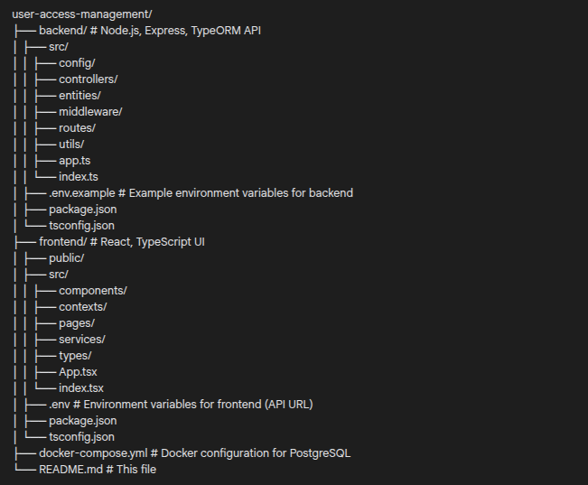

# User Access Management System (Node.js + React + TypeORM)

This project is a User Access Management System developed as per the assignment specifications. It allows for user registration, login & authentication, software listing & creation (by Admins), software access requests by Employees, and managerial approvals of these requests.

## 1. Introduction

### 1.1 Purpose

This system allows:
*   User registration
*   Login & authentication
*   Software access requests
*   Managerial approvals

### 1.2 Scope (Core Features)

*   User Registration
*   JWT-based Authentication
*   Software Listing & Creation (Admin only)
*   Access Request Submission (Employee)
*   Access Request Approval or Rejection (Manager)

## 2. Tech Stack

*   **Backend:** Node.js + Express.js
*   **Frontend:** React
*   **Database:** PostgreSQL
*   **ORM:** TypeORM
*   **Authentication:** JWT (JSON Web Tokens)
*   **Tooling:** `bcrypt` (for password hashing), `dotenv` (for environment variables), `nodemon` (for backend auto-reloading)

## 3. System Overview

### 3.1 User Roles

*   **Employee:** Can sign up, login, request software access.
*   **Manager:** Can view and approve/reject access requests.
*   **Admin:** Can create software, has full access (including Manager and Employee capabilities for viewing/testing).

### 3.2 Functionalities

*   Sign-Up / Login with JWT
*   Role-based redirection
*   Software management (Admin only for creation)
*   Request access to software (Employee)
*   Approve/reject requests (Manager)

## 4. Project Structure

## 5. Prerequisites

*   Node.js (v18.x or later recommended)
*   npm (v8.x or later) or yarn
*   Docker Desktop (or Docker Engine + Docker Compose CLI)
*   Git (for cloning the repository, if applicable)

## 6. Setup and Installation

1.  **Clone the repository (if applicable):**
    ```bash
    git clone <your-repository-url>
    cd user-access-management
    ```

2.  **Database Setup (PostgreSQL via Docker):**
    Ensure Docker is running. From the root project directory (`user-access-management/`), run:
    ```bash
    docker-compose up -d
    ```
    This uses `docker-compose.yml` with the following default credentials:
    *   Database: `mydb`
    *   User: `myuser`
    *   Password: `mypassword`
    *   Host Port: `5433`

3.  **Backend Setup:**
    *   Navigate to `backend/`.
    *   Create a `.env` file from `.env.example` (or create it manually):
        ```env
        # backend/.env
        DB_HOST=localhost
        DB_PORT=5433
        DB_USERNAME=myuser
        DB_PASSWORD=mypassword
        DB_DATABASE=mydb
        JWT_SECRET=yourChosenJwtSecretKey!
        PORT=3001
        ```
        **Important:** Change `JWT_SECRET` to a strong, unique key.
    *   Install dependencies: `npm install` (or `yarn install`)

4.  **Frontend Setup:**
    *   Navigate to `frontend/`.
    *   Create a `.env` file:
        ```env
        # frontend/.env
        REACT_APP_API_URL=http://localhost:3001/api
        ```
    *   Install dependencies: `npm install` (or `yarn install`)

## 7. Running the Application

1.  Ensure the **Database** is running (see step 6.2).
2.  Start the **Backend Server**: In `backend/`, run `npm run dev`. (API on `http://localhost:3001`)
3.  Start the **Frontend Application**: In `frontend/`, run `npm start`. (App on `http://localhost:3000`)

## 8. API Endpoints & Pages

### 8.1 Sign-Up / Login

*   **Backend Endpoints:**
    *   `POST /api/auth/signup` – default role: Employee
        *   Body: `{ "username": "user", "password": "password" }`
    *   `POST /api/auth/login` – returns JWT and role
        *   Body: `{ "username": "user", "password": "password" }`
*   **React Pages:**
    *   `/signup` - Sign-up form
    *   `/login` - Login form

### 8.2 Software Management (Admin)

*   **Backend Endpoint:**
    *   `POST /api/software` – Add new software
        *   Requires Admin role.
        *   Body: `{ "name": "string", "description": "text", "accessLevels": ["Read", "Write", "Admin"] }`
*   **React Page:**
    *   `/admin/create-software` (or similar, e.g., accessible from Admin Dashboard)
        *   Fields: name, description, access levels (e.g., "Read/Write/Admin")

### 8.3 Access Request (Employee)

*   **Backend Endpoint:**
    *   `POST /api/requests` – Submit request
        *   Requires Employee/Admin role.
        *   Body: `{ "softwareId": number, "accessType": "Read" | "Write" | "Admin", "reason": "text" }`
*   **React Page:**
    *   `/employee/request-access` (or similar, e.g., accessible from Employee Dashboard)
        *   Fields: software (dropdown), access type (dropdown, dynamic based on software), reason

### 8.4 Request Approval (Manager)

*   **Backend Endpoint:**
    *   `PATCH /api/requests/:id` – Approve or reject
        *   Requires Manager/Admin role.
        *   URL Param: `id` of the request.
        *   Body: `{ "status": "Approved" | "Rejected" }`
*   **React Page:**
    *   `/manager/pending-requests` (or similar, e.g., accessible from Manager Dashboard)
        *   Lists pending requests and allows manage actions (approve/reject).

### Additional Endpoints Implemented:

*   `GET /api/software`: Lists all software (for Employee request form).
*   `GET /api/requests/my`: (Employee) Lists their own requests.
*   `GET /api/requests/pending`: (Manager) Lists all pending requests for action.

## 9. Database Schema (TypeORM Entities Overview)

*   **User Entity:** `id`, `username` (unique), `password`, `role` ('Employee' | 'Manager' | 'Admin')
*   **Software Entity:** `id`, `name`, `description` (text), `accessLevels` (string array e.g., ["Read", "Write", "Admin"])
*   **Request Entity:** `id`, `user` (relation to User), `software` (relation to Software), `accessType` ('Read' | 'Write' | 'Admin'), `reason` (text), `status` ('Pending' | 'Approved' | 'Rejected'), `createdAt`, `updatedAt`.

## 10. Testing User Roles

*   New users sign up as **Employees**.
*   To test **Manager** or **Admin** roles:
    1.  Sign up a user.
    2.  Connect to the PostgreSQL database:
        ```bash
        docker exec -it pg_dev psql -U myuser -d mydb
        ```
    3.  Update the user's role:
        ```sql
        UPDATE "user" SET role = 'Admin' WHERE username = 'your_test_username';
        -- OR
        UPDATE "user" SET role = 'Manager' WHERE username = 'your_test_username';
        ```
    4.  Log in with this user on the frontend.
